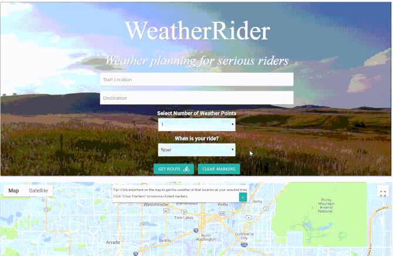

# Weather Rider
This app allows users to plot a bike route using the Google Maps API, and have an arbitrary number (up to 12) of waypoints along the route  display weather information at each location. For bikers who've had the experience of weather changes mid-ride, or simply enjoy detailed and hyperlocal weather information, this app is for you. 

Weather Rider also allows users to select a start-time for advanced ride planning. This is especially helpful if you have a long weekend ride in mind but want to make sure ahead of time that your route will have favorable weather conditions. 

A key feature of this app is the incorporation of the biker's heading (via their selected route) into the weather information, which gives access to a headwind component. This allows bikers to be more informed when planning their routes. All 25-mph winds are not created equal. 

Users can also click anywhere on the map to provide weather information for that specific location, matching the time they set for their ride. E.g. If a user selects a ride for the following day at noon, clicking on the map will give weather information for that location at noon the following day. 

## How can you help
Given the excessive bounds of the Google Maps API, there are likely scenarios which provide buggy results for users. Collaborators can find these bugs and help address them. 

Currently, when an endpoint is dragged to modify the route, all markers are reset and moved except the origin and destination markers since these are created automatically by Google's DirectionsRenderer class. It would be beneficial to find a way to have these removed, short of suppressing the markers, which limits the functionality of draggable endpoints. 

The route sumary could also be styled in a way more accomodating to mobile devices and more easily digestable for longer rides. 

Another useful addition would be a feature to allow generating routes simply by clicking on the map (ala MapMyRide for those familiar). This would likely involve invoking DirectionService's route() method on each click and thereby regenerating the route. But for users interested in very specific route-making capabilities, this feature would be quite useful. Along these lines, editor buttons like "There and back" to duplicate the route in the return direction and similar would add useful functionality. An elevation metric, ever important to cyclists (though perhaps not as much as wind!), would likewise be helpful. 

 

